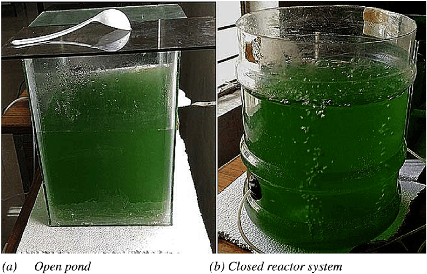
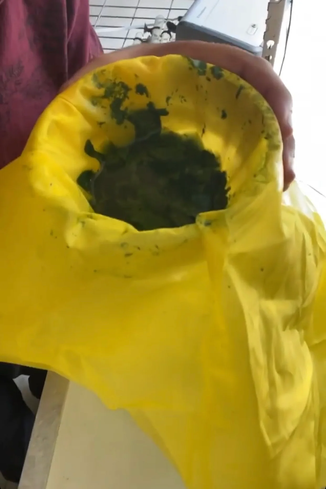
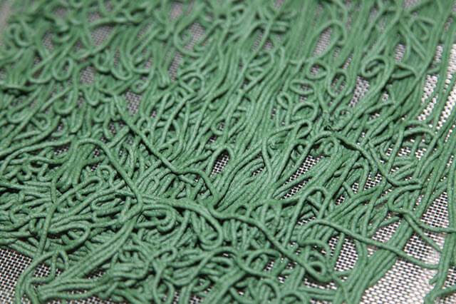
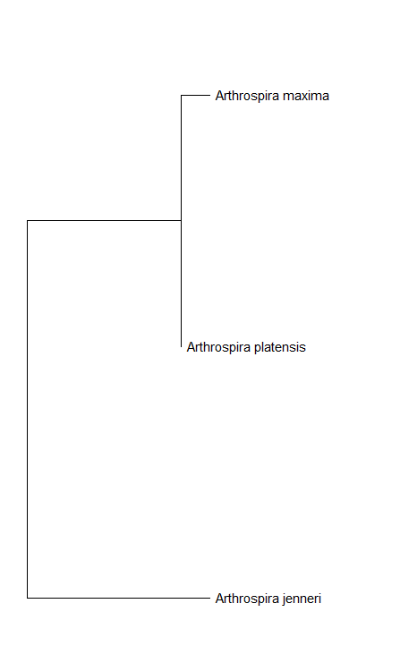
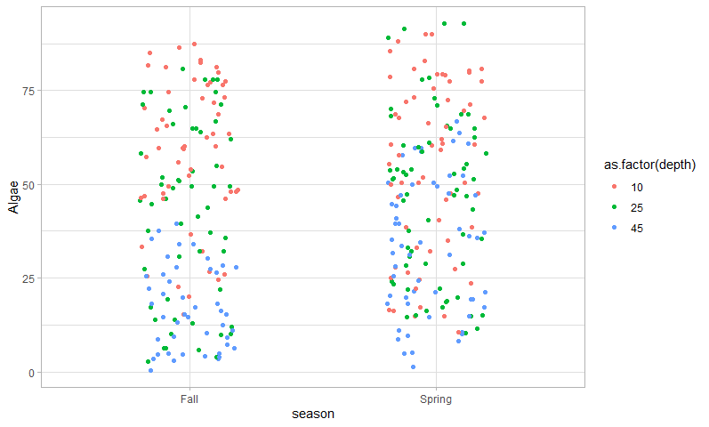
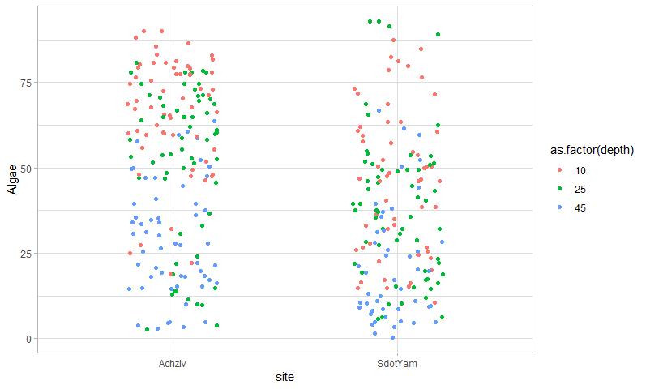
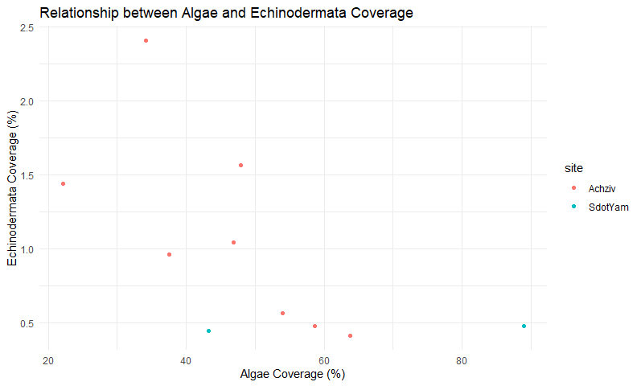
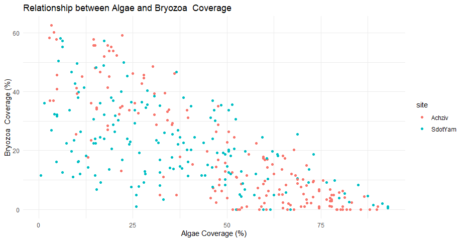
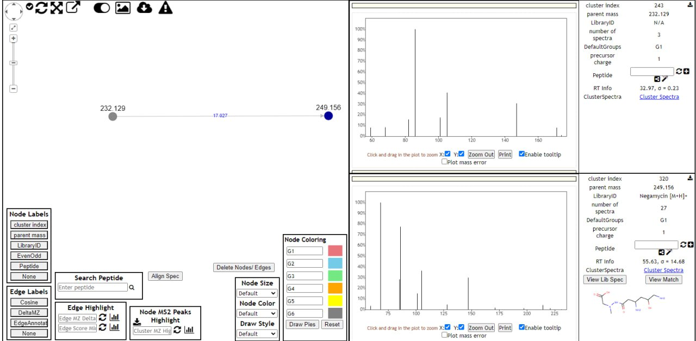

# Results Summary
______________________________________________________
## Protocol for growing Spirulina
## Climatic Factors
*Optimum growth temperature:* **35°C**  
*Growth ceases below 20°C and above 38°C*  
*Light:* **30% of full sunlight is ideal; avoid prolonged strong illumination**  
*Agitate culture to prevent prolonged exposure to full sunlight*  

## Culture Medium Preparation
**Example composition:**  
- **Sodium carbonate:** 5 g/L  
- **Sodium chloride:** 5 g/L  
- **Potassium nitrate:** 2 g/L  
- **Sodium bicarbonate:** 1 g/L  
- **Potassium sulfate:** 1 g/L  
- **Urea:** 0.02 g/L  
- **Monoammonium phosphate:** 0.1 g/L  
- **Magnesium sulfate:** 0.2 g/L  
- **Lime:** 0.02 g/L  
- **Ferrous sulfate:** 0.005 g/L  

## Seeding
Use a spirulina strain with high coiled filaments and high gamma-linolenic acid (GLA) content.  
Maintain culture at a concentration of 0.3 g/L after dilution.  

## Growing Conditions
Keep the culture depth between 10 and 20 cm.  
Maintain culture medium's pH around 10.4 by adding CO2 or bicarbonate as needed.  
Provide continuous or regular agitation.  

## Harvesting
1. **Filtration:**  
   - Use fine weave cloth (30-50 microns).  
   - Filter the culture using gravity.  
   - Support filtration cloth with a net to protect from rupturing.
2. **Dewatering:**  
   - Press biomass to remove residual culture medium.  
   - Use a strong cotton cloth and apply pressure with a heavy object for about 15 minutes.  

## Drying
- Extrude biomass into rods (1-2 mm diameter) and dry on a plastic perforated tray.
- Protect from contamination and limit drying temperature to 68°C for up to 7 hours.
- Final product should have less than 9% water content.

## Feeding the Culture
Add nutrients to maintain medium fertility:  
- **Urea:** 300 g/kg of harvested spirulina  
- **Monoammonium phosphate:** 50 g/kg  
- **Potassium sulfate:** 30 g/kg  
- **Magnesium sulfate:** 30 g/kg  
- **Lime:** 10 g/kg  
- **Iron sulfate:** 2.5 g/kg  
- **Micronutrients solution:** 5 ml/kg (optional)  

## Maintenance
- Regularly agitate the culture.
- Compensate for evaporation with clean water.
- Manage pH and salinity to avoid undesirable exopolysaccharide (EPS) production.
- Monitor for contaminants and renew culture medium as necessary.

## Culture Medium Composition
| **Component**                  | **Concentration (g/L)** |
|--------------------------------|-------------------------|
| Sodium carbonate (soda ash)    | 5.0                     |
| Sodium chloride                | 5.0                     |
| Potassium nitrate              | 2.0                     |
| Sodium bicarbonate             | 1.0                     |
| Potassium sulfate              | 1.0                     |
| Urea                           | 0.02                    |
| Monoammonium phosphate         | 0.1                     |
| Magnesium sulfate (MgSO4·7H2O) | 0.2                     |
| Lime                           | 0.02                    |
| Ferrous sulfate (FeSO4·7H2O)   | 0.005                   |

## Anions and Cations Composition
| **Ion**      | **Concentration (mg/L)** |
|--------------|---------------------------|
| Carbonate    | 2800                      |
| Bicarbonate  | 720                       |
| Nitrate      | 614                       |
| Phosphate    | 80                        |
| Sulfate      | 350                       |
| Chloride     | 3030                      |
| Sodium       | 4380                      |
| Potassium    | 642                       |
| Magnesium    | 10                        |
| Calcium      | 10                        |
| Iron         | 0.8                       |
| Urea         | < 50                      |

## Recommended Feed Formula
| **Nutrient**                   | **Amount per kg of harvested spirulina (dry product)** |
|--------------------------------|---------------------------------------------------------|
| Urea                           | 300 g                                                   |
| Monoammonium phosphate         | 50 g                                                    |
| Potassium sulfate              | 30 g (or 40 g if no potassium nitrate is used in culture)|
| Magnesium sulfate*             | 30 g                                                    |
| Lime                           | 10 g                                                    |
| Iron sulfate*                  | 2.5 g                                                   |
| Micronutrients solution**      | 5 ml     
*Use crystallized commercial product (e.g., MgSO4·7H2O).  
**Optional, supplied by Antenna Technology, Geneva.

## Photos

 
*Figure 1: Spirulina culture in a pond with optimal growth conditions.*

 
*Figure 2: Harvesting spirulina using fine weave cloth.*

 
*Figure 3: Extruded spirulina rods drying on a perforated tray.*

## Online Protocol
- [Protocol for the transformation and engineering of edible algae Arthrospira platensis to generate heterologous protein-expressing strains](https://www.ncbi.nlm.nih.gov/pmc/articles/PMC9929480/)

_____________________________________________________

# Primer Picking Results for DQ185137.1 Arthrospira platensis HalA (halA) Gene, Complete CDS

## Top Primer Pair

**Left Primer:**  
- **Sequence:** `CGTCTGTGCGAAGAAGTACG`
- **Start Position:** 55
- **Length:** 20
- **Tm:** 59.02°C
- **GC%:** 55.00%

**Right Primer:**  
- **Sequence:** `CATTTCCGGGGTTTTCAGGG`
- **Start Position:** 234
- **Length:** 20
- **Tm:** 59.11°C
- **GC%:** 55.00%

**Product Size:** 180 bp  
**Pair Complementarity:** 0.00

## Additional Primer Pairs

### Pair 1
**Left Primer:**  
- **Sequence:** `AGAAGCCTTCCCCGATGATC`
- **Start Position:** 168
- **Length:** 20
- **Tm:** 59.24°C
- **GC%:** 55.00%

**Right Primer:**  
- **Sequence:** `ACTGCCATTACCGCGATCTA`
- **Start Position:** 333
- **Length:** 20
- **Tm:** 58.96°C
- **GC%:** 50.00%

**Product Size:** 166 bp  
**Pair Complementarity:** 0.00

### Pair 2
**Left Primer:**  
- **Sequence:** `CGCTATTGATGCCGTACTCG`
- **Start Position:** 27
- **Length:** 20
- **Tm:** 58.95°C
- **GC%:** 55.00%

**Right Primer:**  
- **Sequence:** `GATCATCGGGGAAGGCTTCT`
- **Start Position:** 187
- **Length:** 20
- **Tm:** 59.24°C
- **GC%:** 55.00%

**Product Size:** 161 bp  
**Pair Complementarity:** 9.21

### Pair 3
**Left Primer:**  
- **Sequence:** `TCCCGGAATGTTGTTTGTGG`
- **Start Position:** 486
- **Length:** 20
- **Tm:** 58.68°C
- **GC%:** 50.00%

**Right Primer:**  
- **Sequence:** `GGTAATTCCCGCAGCTTGAG`
- **Start Position:** 675
- **Length:** 20
- **Tm:** 58.98°C
- **GC%:** 55.00%

**Product Size:** 190 bp  
**Pair Complementarity:** 0.00

### Pair 4
**Left Primer:**  
- **Sequence:** `ATCCCGTCAAAATGCGATCG`
- **Start Position:** 636
- **Length:** 20
- **Tm:** 59.06°C
- **GC%:** 50.00%

**Right Primer:**  
- **Sequence:** `CGGCCTCTTCAACGACAATC`
- **Start Position:** 829
- **Length:** 20
- **Tm:** 59.28°C
- **GC%:** 55.00%

**Product Size:** 194 bp  
**Pair Complementarity:** 0.00

## Overall Primer Statistics

- **Left Primers Considered:** 4379
- **Right Primers Considered:** 4598
- **Pairs Considered:** 991
- **Pairs with Acceptable Product Size:** 6

These primers were selected based on their melting temperature, GC content, and the absence of significant hairpin structures or dimer formations, ensuring high specificity and efficiency for PCR amplification.

__________________________________________

# Phylogenetic tree in MEGA. 
A bootstrap consensus version tree was constructed.

Analysis of:
 Arthrospira platensis FACHB439 ribulose-1,5-bisphosphate carboxylase/oxygenase large subunit (rbcL) gene, partial cds

Arthrospira jenneri A10 ribulose-1,5-bisphosphate carboxylase/oxygenase large subunit (rbcL) gene, partial cds; chaperonin-like protein (rbcX) gene, complete cds; and ribulose-1,5-bisphosphate carboxylase/oxygenase small subunit (rbcS) gene, partial cds

Arthrospira maxima OUQDSM ribulose-1,5-bisphosphate carboxylase/oxygenase large subunit (rbcL) gene, partial cds

_________________________________________________
# qPCR-Arthrospira-platensis

***Reference gene***

**Left Primer:**  
- **Sequence:** `CGTCTGTGCGAAGAAGTACG`
- **Start Position:** 55
- **Length:** 20
- **Tm:** 59.02°C
- **GC%:** 55.00%

**Right Primer:**  
- **Sequence:** `CATTTCCGGGGTTTTCAGGG`
- **Start Position:** 234
- **Length:** 20
- **Tm:** 59.11°C
- **GC%:** 55.00%

**Product Size:** 180 bp  
**Pair Complementarity:** 0.00

Why 16S rRNA is a Good Reference Gene for qPCR:
1. Highly Conserved Sequence:
The 16S rRNA gene has a highly conserved sequence across different species, including Arthrospira platensis. This conservation ensures that the gene's expression is stable and reliable for comparison across various experimental conditions.

2. Essential Cellular Function:
As a component of the ribosomal RNA, the 16S rRNA gene is crucial for protein synthesis in the ribosome. Its fundamental role in cellular function means its expression levels remain relatively constant, regardless of external conditions or treatments.

---

***Response Gene***

**Left Primer:**  
- **Sequence:** `CTCAGTTGCTGATGATTATA`
- **Start Position:** 1
- **Length:** 20
- **Tm:** 54.02°C
- **GC%:** 35.00%

**Right Primer:**  
- **Sequence:** `TCTATTTAAATCCAAGCTTA`
- **Start Position:** 654
- **Length:** 20
- **Tm:** 52.11°C
- **GC%:** 35.00%

**Product Size:** 654 bp  
**Pair Complementarity:** 0.00

Why Photosystem II q(b) protein (A-PsQB gene) is a Good Response Gene for qPCR:
1. Involved in Photosynthetic Process:
The A-PsQB gene is involved in the photosynthetic process, which is highly responsive to environmental changes such as light intensity, quality, and stress conditions. This makes it an excellent gene to study changes in response to varying experimental treatments.

2. Indicator of Photosynthetic Efficiency:
As part of the photosystem II complex, the A-PsQB gene can serve as an indicator of photosynthetic efficiency and health in Arthrospira platensis. Its expression levels can provide insights into the physiological state of the organism under different conditions.

____________________________________________________________________
# R Data Analysis of Photosurvey

The goal of this analysis is to investigate and comprehend how the presence of algae is influenced by seasons, depths, and years. The data was processed using R, and various statistical analyses were performed to determine the significance of these factors.

## Let's look at the presence of algae:

As we can see, there is more algae presence at 10 and 25 meters. This is understandable because algae depend on sunlight. We should also mention that algae have the highest representation and were found in all samples (the lowest was at 45 meters and was estimated as 0.48 - you can notice the small blue dot at the edge of the X vector). Also, we can notice that seasons don't affect algae much.

### Kruskal-Wallis Test

Kruskal-Wallis chi-squared = 87.592, df = 2, p-value < 2.2e-16

Since the p-value is far less than any commonly used significance level, this means there is extremely strong evidence to suggest that the distributions of algae presence are significantly different across the different depths. This indicates that depth has a significant effect on the presence of algae.

## For comparison, let's look at the representation of the lowest taxonomic group, Mollusca.

In comparison to algae, Mollusca have a very sparse presence, only in 4 measurements! This makes up 1.17% of total measurements. This also explains why we have so much algae, as many Mollusca species are herbivores, and their presence might reduce algae.

## Let's analyze the sites.

 
We can see clearly that in the Achziv site, the presence of algae is higher, especially at lower depths. Algae need a proper substrate to attach to, so Achziv might have better conditions for algae or less pressure from herbivores. Let's check this theory by comparing the presence of algae with echinodermata.

As we can see, there is some competition between these two taxonomic groups, but due to a lack of data, we can't be sure. Let's also check Bryozoa; maybe the competition for substrate is higher than the prey-predator connection.

And yes! We see a strong correlation between these two groups, let's do a Kruskal-Wallis Test.

### Kruskal-Wallis Test

Kruskal-Wallis chi-squared = 255.54, df = 170, p-value = 2.392e-05

Since the p-value is far less than any commonly used significance level, this means there is strong evidence to suggest that the distributions of algae presence are significantly different across the different levels of Bryozoa. This indicates that Bryozoa has a significant effect on the presence of algae.

## Conclusion

In conclusion, the analysis indicates that depth, site conditions, and the presence of other taxonomic groups significantly influence the distribution of algae. Depth plays a crucial role, with more algae presence at shallower depths due to the dependency on sunlight. The site-specific analysis suggests that environmental factors and the presence of herbivores like Mollusca and competitors like Bryozoa and Echinodermata affect algae distribution.

______________________________________________________
# Metabolomics analysis
Here is an analysis of a metabolomics of a antibiotic Negamycin.

As we can see one molecule has a mass difference 17.027. I have a theory that this molecule has an additional hydroxyl group.

